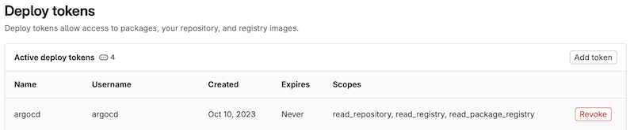
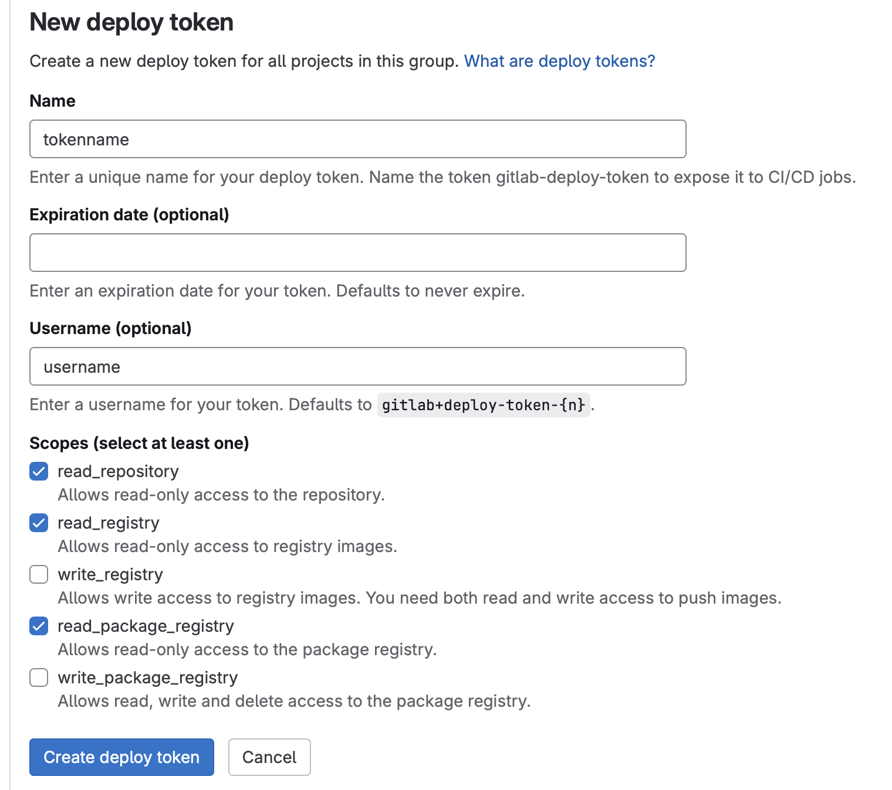
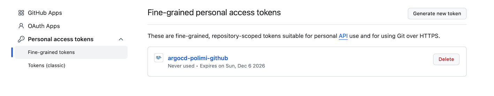
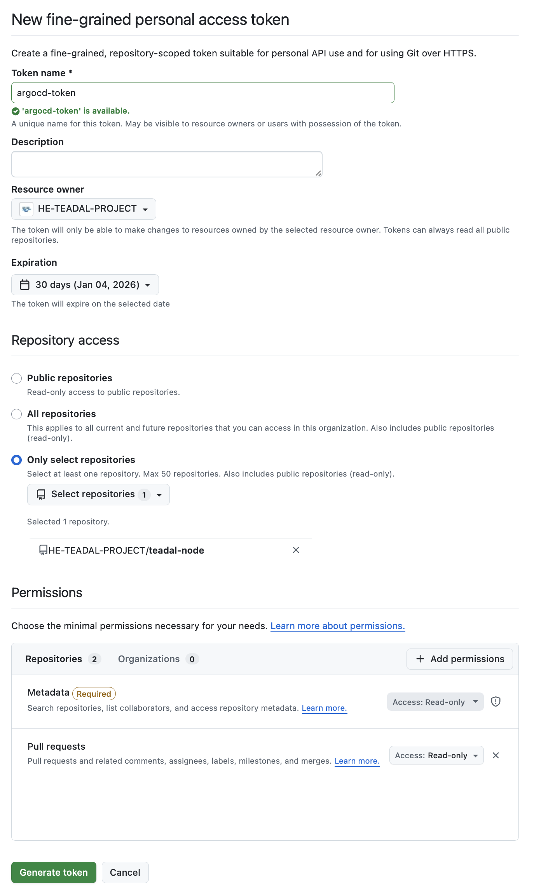

# Obtain a deploy token for ArgoCD

TEADAL node is based on ArgoCD and to enable the communication between ArgoCD and the Git repo the TEADAL node has to be authenticated.

For this reason ArgoCD must be configured, in addition to the URL of the git repo, with the credentials for the API communication with the repo. Those credentials are defined in git repo as a deploy token.

Here a short description on how to obtain this deploy token in case you repo is stored in gitlab or github.

## GitLab

If your repo is on GitLab, the deploy token is defined at repository level. 

Go to the page *Setting>Repository>Deploy tokens*. 

Then *Expand>Add token* and insert a new token like the one in the following figure. Take note of the *username* (if you do not indicate a name, gitlab will generate it) and the *token* created.

## GitHub

If you repo is on GitHub, the deploy token is defined at user level. 

Go to the github user profile page and select Setting > Developer Settings

Under Personal Access Tokens > Fine-grained tokens, select "Generate new token"

Give a name to the token (this will be required when configuring ArgoCD), define the resource owner (depends on the owner of the repo) and an expiration date.
We suggest to grant the access with the deploy token only to the repo containing the TEADAL node.
Among the permission is fundamental to have the "pull request".

Once the "generate token is clicked" the value of the deploy token is show only once and it must be stored as it will be required during the configuration of ArgoCD.
